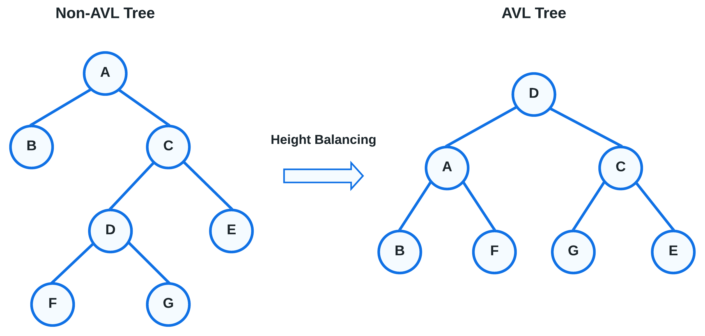

# AVL Tree Text Analyzer

This C++ program is a simple text file analyzer, utilizing a self-balancing AVL tree to store and extract information from text. The program takes a text file and produces useful information such as the counts of each unique word, the total word count, the most common word, etc. By utilizing a self-balancing AVL Tree, the program is able to scan large text files fast and efficiently when compared to more common data structures such as linked lists or arrays.

## Features

- **Self-Balancing AVL Tree:** The program scans through the text file and creates a node for every unique word, holding both the word, and the number of times it is used in the text. This node is then added to a self-balancing AVL Tree, which applies height-balancing to the tree every time a node is added.

- **Text Word Count:** By storing individual word counts in each node, the program can keep track of the total word count, the number of unique words, and the appearance count of each unique word.

- **Extra-Information:** The program can scan the AVL Tree to get extra pieces of information, such as the number of singleton words (unique words that only appear once in the text) and the single most repeated word in the text

## What is an AVL Tree?

The program scans through the text file, storing each unique word it finds into a node, along with the number of occurrences of that word. The node is then added to the AVL Tree data structure. An AVL tree is a self-balancing binary search tree where the height difference between the left and right subtrees of any node is always kept to a minimum, in this case 1, ensuring logarithmic time complexity for search, insertion, and deletion operations. When a node is added or removed, the tree automatically adjusts its structure through rotations to maintain balance. This height-balancing property helps optimize the efficiency of common tree operations making AVL trees valuable in applications working with large datasets, where quick performance is essential.



An unbalanced tree is no longer an AVL Tree, so when a new node is added, the tree is rebalanced. Height balancing is achieved through rotating leaf nodes around a non-leaf node, and shifting a child subtree of a node whose height is too large to a node of smaller height. Doing this every time a new node is added ensures the tree remains balanced, and thus remains an AVL Tree.

## Installation and Use

1. Clone the repository to your local machine:

   ```bash
   git clone https://github.com/Daksh2060/avl-tree-text-analyzer-cpp
   ```

2. Use the provided makefile to compile:

   ```bash 
   make analyze
   ```

3. To run program on a textfile you have two choices:

   You can input the text file and read the results in the terminal (not recommended for large files):
   ```bash 
   ./analyze < file_name.txt
   ```

   Or you can generate the results as an output file: 
   ```bash 
   ./analyze < file_name.txt > output_name
   ```

4. An example usage with the included text file:

   ```bash 
   ./analyze < test.txt > test_output
   ```


